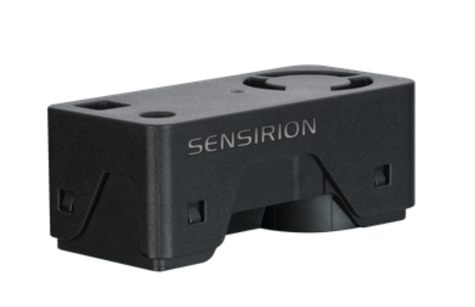
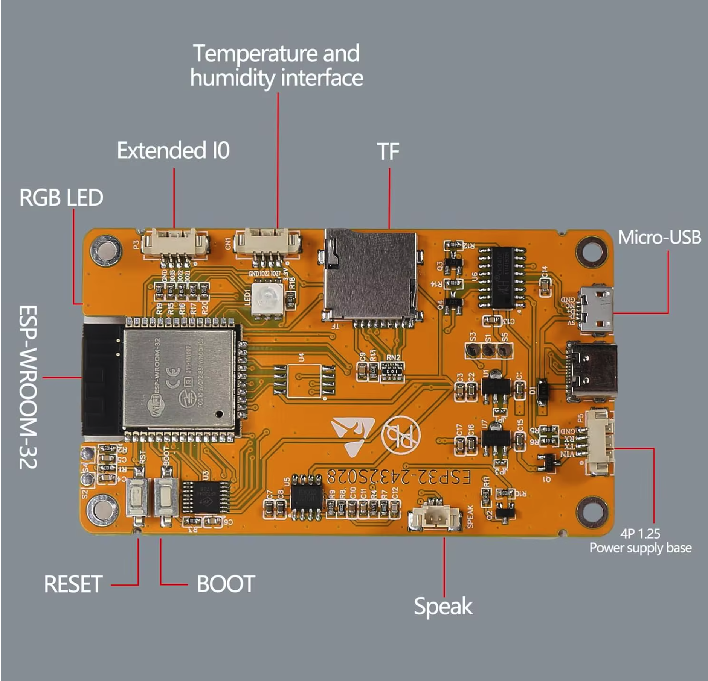
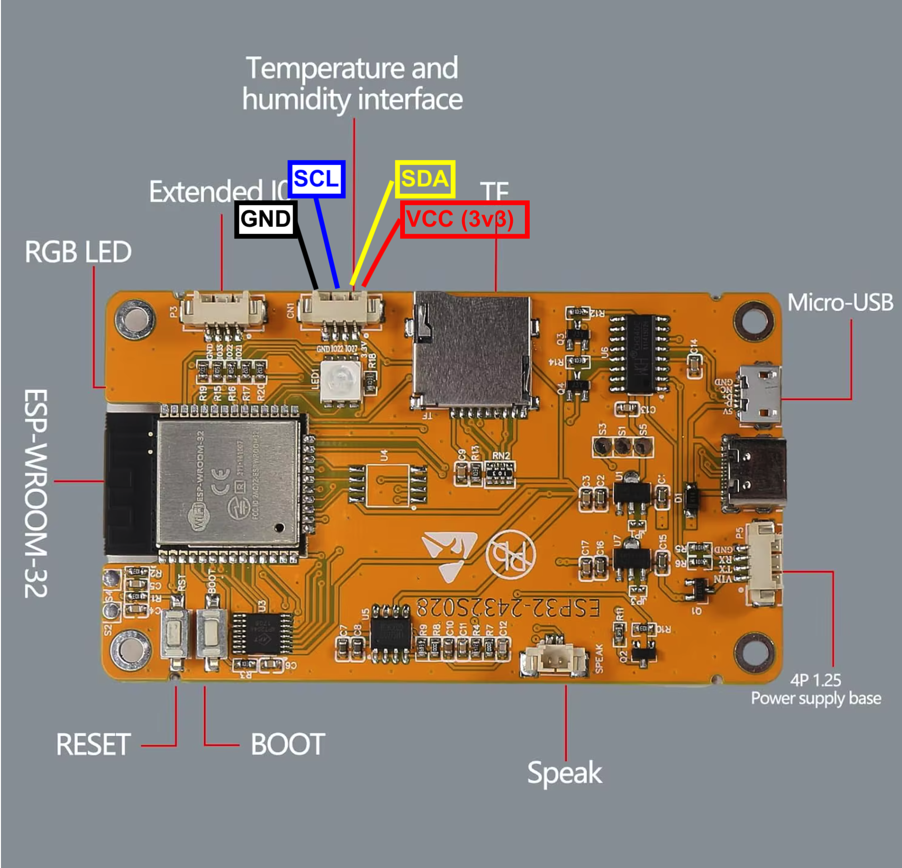

# SEN66 Dashboard for CYD ILI9341

<div align="center">

</div>

## Disclaimer
This software is developed incrementally. That means I have no clear idea how it works (though it mostly does).

If you have questions about this software, it will probably take you just as long to figure things out as it would take me. So I’d prefer that you investigate it yourself.

Having said that Don’t Even Think About Using It

Seriously. Don’t.

Building this design may injure or kill you during construction, burn your house down while in use, and then—just to be thorough—explode afterward.

This is not a joke. This project involves lethal voltages. If you are not a qualified electronics engineer, close this repository, step away from the soldering iron, and make yourself a cup of tea.

If you decide to ignore all of the above and build it anyway, you do so entirely at your own risk. You are fully responsible for taking proper safety precautions. I take zero responsibility for anything that happens—electrically, mechanically, chemically, spiritually, or otherwise.

Also, full disclosure: I am not a qualified electrical engineer. I provide no guarantees, no warranties, and absolutely no assurance that this design is correct, safe, or suitable for any purpose whatsoever.

## What it is
This PlatformIO project targets a CYD style ESP32 board with an ILI9341 display and a 3x3 LVGL dashboard.
A Desktop device that measures and display the air quality in the room.

<div align="center">

</div>

## Included environments

- `cyd_ili9341`

<div align="center">

</div>

  - Main runtime environment for ILI9341
  - Uses the calibrated display configuration
  - `UPDATE_INTERVAL=2500` (milliseconds)
  - `SIMULATION` to show simulated data without using the SEN66

- `ili9341_r4`
  - Display validation environment with `TEST_DISPLAY=1`
  - Shows diagnostic pages (color bars, grid, corner markers, info)

## Display calibration summary

The panel is stable with:

- `CYD_LCD_ROTATION=4`
- `CYD_LCD_PANEL_WIDTH=320`
- `CYD_LCD_PANEL_HEIGHT=240`
- `CYD_LCD_RGB_ORDER=1`

See [ili9341.md](ili9341.md) for full details.

## Sensor wiring for runtime mode

Default I2C pins in `cyd_ili9341`:

- SEN66 VDD -> 3V3
- SEN66 GND -> GND
- SEN66 SDA -> GPIO27
- SEN66 SCL -> GPIO22

<div align="center">

</div>

Important: on the ILI9341 variant, using GPIO21 for SDA conflicts with the display backlight pin and can make the screen appear black.

## Simulation mode

When `SIMULATION=1` is enabled:

- sensor read logic is skipped
- all nine tiles are updated with synthetic values
- each tile follows a different up/down waveform
- values do not peak at the same time, making color transitions easy to inspect

## Runtime timing

- `UPDATE_INTERVAL` is in milliseconds (ms)
- Set it in `platformio.ini` via build flag, for example:
  - `-D UPDATE_INTERVAL=2500` for 2.5 s
  - `-D UPDATE_INTERVAL=5000` for 5.0 s

The dashboard still shows human-readable time in seconds in the header.

## UI behavior notes

- Header status text uses a fixed position block to avoid left/right jumping when line lengths change.
- The second status line (`Just updated` / `Updated ...`) is tuned to sit close under the first line.
- The existing vertical line at the right side of each tile (LVGL scrollbar part) follows the same color as the tile value.

## MQTT
Measured data is published over MQTT.

WiFi is required before MQTT can connect.

At startup the device first tries stored WiFi credentials. If no credentials are stored, or connection fails, it starts the WiFiManager on-demand captive portal (timeout: 5 minutes).

When the portal starts, the UI and serial output show the AP name to connect to:

- `DAS-a1-2b-3c`

Where `a1`, `2b`, and `3c` are the last three bytes of the ESP32 MAC address.

The WiFi/MQTT portal logic is implemented in:

- `WiFiManagerExt.h`
- `WiFiManagerExt.cpp`

Portal fields:

- MQTT broker URL
- MQTT username (optional)
- MQTT password (optional)
- MQTT broker port (`1883` for plain MQTT, `8883` for TLS)
- MQTT topic (default: AP name + `/data`, for example `DAS-a1-2b-3c/data`)
- MQTT publish interval (ms)

```
{"pm1_0":0.6,"pm2_5":1.0,"pm4_0":1.3,"pm10":1.5,"humidity":52.6,"temperature":17.7,"voc":68,"nox":1,"co2":1372,"timeStamp":"2026-03-28T15:24:41+0100"}
{"pm1_0":0.6,"pm2_5":1.0,"pm4_0":1.3,"pm10":1.5,"humidity":52.6,"temperature":17.7,"voc":68,"nox":1,"co2":1371,"timeStamp":"2026-03-28T15:24:51+0100"}
{"pm1_0":0.6,"pm2_5":1.0,"pm4_0":1.3,"pm10":1.5,"humidity":52.6,"temperature":17.6,"voc":68,"nox":1,"co2":1367,"timeStamp":"2026-03-28T15:25:01+0100"}
```
These values are persisted and shown again as defaults in the portal.
If no topic was saved yet, or the saved topic is empty, the default topic is `DAS-xx-yy-zz/data` based on the last three MAC bytes.

If GPIO0 is held low for longer than 10 seconds, stored WiFi settings are cleared and the device restarts (`ESP.restart()`).

### MQTT payload

Each publish sends one JSON object with the latest sample, for example:

```json
{
  "pm1_0": 7.3,
  "pm2_5": 12.8,
  "pm4_0": 16.2,
  "pm10": 22.1,
  "humidity": 45.6,
  "temperature": 20.4,
  "voc": 103,
  "nox": 84,
  "co2": 721,
  "timestamp": 2026-03-28T15:24:41+0100
}
```

## Build and upload

Examples:

- Build main runtime:
  - `platformio run -e cyd_ili9341`
- Upload main runtime:
  - `platformio run -e cyd_ili9341 --target upload`
- Build display test:
  - `platformio run -e ili9341_r4`

## Dashboard tiles

- CO2
- PM2.5
- VOC
- PM1.0
- PM4.0
- PM10
- Temp
- Hum
- NOx

Tile value colors move from cooler (blue) to warmer tones (red) as badness increases.
